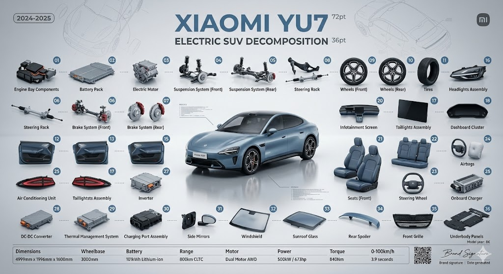

# AIDriveLab Skills Repository

[](https://opensource.org/licenses/MIT)
[](./skills/)
[](https://www.pcfox.cn)

> 🚀 AIDriveLab 自主开发的 AI 技能共享仓库，用于沉淀、共享和迭代各类技术技能、解决方案与最佳实践。

---

## What This Does

AIDriveLab Skills 是一个开源的 AI 技能库，专注于为开发者提供高质量的 AI 辅助工具。我们致力于：

- **沉淀经验**：将最佳实践转化为可复用的技能
- **共享知识**：开放给社区，共同进步
- **持续迭代**：根据用户反馈不断优化

---

## Key Features

- **多平台兼容**：支持 Claude、Antigravity、Trae、VS Code、OpenCode 等主流 AI IDE
- **即插即用**：零依赖，无需额外安装，直接导入即可使用
- **专业规范**：遵循 Claude Skills 官方规范，确保技能质量
- **持续更新**：根据用户反馈和 AI 技术发展持续优化
- **开源共享**：MIT 许可证，自由使用和修改

---

## Current Skills

### poster-prompt | 拆解生图提示词生成器

将任何实物（人物穿搭、数码产品、汽车等）拆解为专业艺术海报提示词，支持多种 AI 绘图模型。


**What It Does:**
- 将实物拆解为专业的艺术海报提示词（Decomposition Art Poster）
- 支持 8+ 主流 AI 绘图模型的提示词优化
- 智能推荐风格和布局，无需专业知识

**Supported Models:**
- 🌍 国外：Midjourney、GPT-image、Nano Banana、DALL-E 3
- 🇨🇳 国内：即梦/Seedream、通义万相、豆包、腾讯混元

**Key Features:**
- 实物拆解展示（爆炸图、网格布局）
- 15+ 预设风格（科技工业、时尚杂志、极简主义等）
- 智能风格推荐
- 多模型提示词适配

[查看详情 →](./skills/poster-prompt/)

---

## Installation

### For Claude Users

Copy the skill files to your Claude skills directory:

```bash
# Create the skill directory
mkdir -p ~/.claude/skills/poster-prompt

# Copy the files (or download from this repo)
cp -r skills/poster-prompt/* ~/.claude/skills/poster-prompt/
```

Then use it by typing in Claude:
```
帮我拆解这个机械键盘
```

### For Trae Users

Place the skill in your Trae skills directory:

```bash
# Create the skill directory
mkdir -p .trae/skills/poster-prompt

# Copy the files
cp -r skills/poster-prompt/* .trae/skills/poster-prompt/
```

### For VS Code + Cline Users

Configure the skills path in your Cline settings:

```json
{
  "cline.skillsPath": "./skills"
}
```

### For Antigravity / OpenCode Users

Download the skill ZIP file and import it through the IDE's skills manager.

---

## Usage

### Basic Workflow

1. **Activate Skill**: Trigger the skill in your IDE (e.g., "拆解机械键盘")
2. **Select Model**: Tell the AI which image generation model you're using
3. **Describe Needs**: Specify the item to decompose and style preferences
4. **Get Prompt**: Receive optimized prompts for your chosen model
5. **Generate Image**: Copy the prompt to your AI image generation tool

### Example

```
用户：帮我拆解这个机械键盘
AI：请问你使用的是哪个 AI 绘图模型？
用户：豆包
AI：【生成豆包优化的中文提示词】
```

---

## Files

| File | Purpose |
|------|---------|
| `README.md` | 本文件 |
| `LICENSE` | MIT 许可证 |
| `skills/poster-prompt/SKILL.md` | 技能入口文件 |
| `skills/poster-prompt/assets/` | 模板资源目录 |
| `skills/poster-prompt/references/` | 参考文档和配置 |

---

## Philosophy

This repository was built on the belief that:

- **Knowledge should be shared** — Best practices belong to everyone, not locked in private repos
- **Skills should be reusable** — Don't reinvent the wheel every time
- **Quality matters** — Follow official specifications and maintain high standards
- **Community drives progress** — Feedback and contributions make us better

---

## Roadmap

- [x] poster-prompt：拆解生图提示词生成器
- [ ] code-review：代码审查助手
- [ ] doc-generator：文档生成器
- [ ] test-writer：测试用例生成器
- [ ] api-designer：API 设计助手

---

## Requirements

- Claude Code CLI 或其他兼容的 AI IDE
- 无需额外依赖（零依赖设计）

---

## Contributing

We welcome community contributions! Please follow these steps:

1. Fork this repository
2. Create a feature branch (`git checkout -b feature/amazing-skill`)
3. Commit your changes (`git commit -m 'Add amazing skill'`)
4. Push to the branch (`git push origin feature/amazing-skill`)
5. Open a Pull Request

### Skill Development Guidelines

- Follow [Agent Skills Specification](https://agentskills.io/specification)
- Keep SKILL.md under 500 lines
- Provide clear examples and edge case handling
- Include multi-platform compatibility notes

---

## License

MIT — Use it, modify it, share it.

---

## Credits

Created by [AIDriveLab](https://www.pcfox.cn) with Claude Code.

---

## Links

- 🌐 官网：[www.pcfox.cn](https://www.pcfox.cn)
- 💬 讨论：[GitHub Discussions](../../discussions)
- 🐛 问题反馈：[GitHub Issues](../../issues)

---

<p align="center">
  Made with ❤️ by <a href="https://www.pcfox.cn">AIDriveLab</a>
</p>
