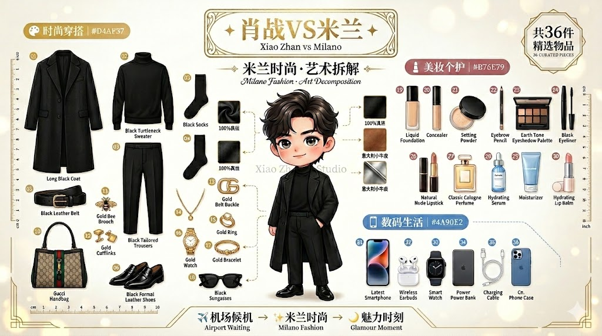

# Poster-Prompt Skills 完整使用指南

> **万物拆解生图提示词生成器** - 将任何实物转化为专业艺术海报提示词

---

## 📋 目录

1. [技能概述](#一技能概述)
2. [功能特点](#二功能特点)
3. [提示词效果展示](#三提示词效果展示)
4. [Python脚本说明](#四python脚本说明)
5. [使用指南](#五使用指南)
6. [最佳实践](#六最佳实践)

---

## 一、技能概述

### 1.1 核心功能

**Poster-Prompt Skills** 是一款专业的 AI 辅助工具，旨在帮助用户将任何实物（人物穿搭、数码产品、汽车、家居用品等）拆解为高质量的艺术海报提示词。通过智能分析和风格适配，生成适用于多种 AI 绘图模型的专业提示词。

### 1.2 设计目的

- **降低门槛**：无需掌握复杂的设计术语和提示词工程知识
- **提升效率**：快速生成多模型适配的专业提示词
- **保证质量**：基于最佳实践和美学原则生成提示词
- **风格统一**：通过变量库确保输出风格的一致性

### 1.3 应用场景

| 场景 | 示例 | 输出效果 |
|------|------|----------|
| **时尚穿搭** | 明星同款服装拆解 | 时尚杂志风格海报 |
| **数码产品** | 机械键盘、耳机拆解 | 科技工业风格海报 |
| **汽车机械** | 汽车部件、引擎拆解 | 工程蓝图风格海报 |
| **家居生活** | 咖啡机、厨具拆解 | 生活美学风格海报 |
| **艺术创作** | 手办、艺术品拆解 | 艺术油画风格海报 |

### 1.4 解决的问题

1. **提示词质量不稳定** → 标准化模板确保输出质量
2. **模型适配困难** → 自动生成多模型专用提示词
3. **风格难以把控** → 15+预设风格智能推荐
4. **学习成本高** → 自然语言交互，无需专业知识

---

## 二、功能特点

### 2.1 核心功能模块

#### 2.1.1 智能拆解分析

```
输入：实物图片或文字描述
处理：AI视觉分析/语义理解
输出：部件清单 + 布局建议 + 风格推荐
```

**支持的分析维度：**
- 物品类别识别（数码/时尚/汽车/家居等）
- 部件自动提取（键帽、轴体、PCB板等）
- 布局结构分析（网格/放射/分层等）
- 风格特征识别（科技/时尚/复古等）

#### 2.1.2 多模型提示词生成

| 模型类型 | 提示词特点 | 适用场景 |
|----------|-----------|----------|
| **Midjourney** | 英文详细描述 + 参数 | 专业设计师 |
| **GPT-image** | 完整句子描述 | 自然语言偏好 |
| **Nano Banana** | 中英混合结构化 | 通用场景 |
| **即梦/Seedream** | 中文精简描述 | 国内用户 |
| **通义万相** | 中英混合 | 阿里云生态 |
| **豆包** | 中文简洁 | 字节生态 |

#### 2.1.3 风格系统

**15+ 预设风格：**

| 风格名称 | 英文名 | 特点描述 | 适用物品 |
|----------|--------|----------|----------|
| 科技工业风 | Tech Industrial | 深蓝渐变、霓虹光效、蓝图网格 | 数码产品 |
| 时尚精美风 | Fashion Elegant | 白色背景、金色点缀、高级感 | 服饰珠宝 |
| 极简主义 | Minimalist | 简洁线条、留白设计、现代感 | 简约产品 |
| 复古怀旧 | Vintage Retro | 暖色调、胶片质感、怀旧感 | 老物件 |
| 赛博朋克 | Cyberpunk | 霓虹色彩、未来感、科技潮流 | 科技产品 |
| 自然生态 | Nature Eco | 绿色系、自然光、生态感 | 植物户外 |
| 美食诱惑 | Food Delicious | 暖色调、诱人光泽、食欲感 | 美食餐饮 |
| 运动活力 | Sports Dynamic | 动感线条、活力色彩、运动感 | 运动健身 |
| 艺术油画 | Art Painting | 油画质感、艺术笔触、创意感 | 艺术创作 |
| 皮克斯风格 | Pixar Style | 卡通渲染、可爱风格、亲和力 | 卡通人物 |
| 军事科技 | Military Tech | 军绿色、战术感、硬朗风格 | 军事装备 |
| 奢华高端 | Luxury Premium | 黑金配色、高端质感、奢华感 | 奢侈品 |
| 清新可爱 | Fresh Cute |  pastel色系、圆润设计、可爱风 | 儿童用品 |
| 暗黑风格 | Dark Gothic | 深色调、神秘感、哥特元素 | 特殊主题 |
| 日式和风 | Japanese Style | 和风元素、樱花、禅意 | 日式产品 |

#### 2.1.4 布局系统

**6种经典布局：**

1. **经典三段式**
   - 顶部 1/3：标题区
   - 中间 1/2：部件展示区
   - 底部 1/6：信息区

2. **中心放射式**
   - 中心：主体物品
   - 周围：放射状排列部件

3. **整齐网格状**
   - 4×6 或 3×5 网格排列
   - 适合部件较多的物品

4. **水平分层式**
   - 从上到下分层展示
   - 适合展示组装顺序

5. **对角线式**
   - 从左上到右下排列
   - 动感十足

6. **圆形环绕式**
   - 中心主体，圆形环绕部件
   - 视觉聚焦

### 2.2 技术特点

#### 2.2.1 变量化设计系统

通过 YAML 配置文件管理设计元素：

```yaml
# 颜色变量示例
colors:
  tech_blue:
    primary: "#1a365d"
    secondary: "#00d4ff"
    background: "#0a1929"
  
# 边框变量示例  
borders:
  tech_frame:
    style: "1px solid #00d4ff"
    radius: "4px"
    glow: "0 0 10px #00d4ff40"
```

#### 2.2.2 智能推荐引擎

基于物品类别自动推荐风格：

```python
# 推荐逻辑示例
recommendations = {
    "数码产品": ["科技工业风", "极简主义", "赛博朋克"],
    "时尚穿搭": ["时尚精美风", "奢华高端", "清新可爱"],
    "汽车机械": ["科技工业风", "军事科技", "极简主义"],
    "家居厨房": ["极简主义", "自然生态", "美食诱惑"]
}
```

#### 2.2.3 微创新引擎

在预设风格基础上生成风格变体：

- **色彩微调**：调整色相、饱和度、明度
- **布局变化**：同一风格的不同布局方案
- **元素替换**：边框、阴影、装饰元素的组合变化
- **混合风格**：两种风格的融合创新

---

## 三、提示词效果展示

### 3.1 案例一：肖战穿搭拆解


#### 3.1.1 需求描述

**输入：**
- 拆解对象：肖战米兰时装周穿搭
- 风格偏好：时尚杂志风格
- 使用模型：Midjourney V6

#### 3.1.2 生成提示词

**Midjourney 版本：**

```
Fashion outfit decomposition poster of Xiao Zhan's Milan Fashion Week look, exploded view showing camel wool coat, black turtleneck sweater, tailored trousers, leather boots, and accessories arranged in elegant horizontal layout, high-end fashion magazine style, clean white background with subtle golden accents, professional commercial photography lighting, luxurious and sophisticated mood, 3:4 aspect ratio --ar 3:4 --v 6 --style raw --s 250
```

**豆包/即梦 版本：**

```
肖战米兰时装周穿搭拆解海报
展示驼色羊毛大衣、黑色高领毛衣、修身长裤、皮靴、配饰
时尚杂志风格，白色背景，金色点缀
优雅水平布局，高级感，商业摄影
```

**Nano Banana 版本：**

```
Fashion outfit decomposition poster, Xiao Zhan Milan Fashion Week style
驼色大衣、黑色高领、修身长裤、皮靴、配饰网格排列
时尚杂志风格，白色背景，金色装饰
高级感，商业摄影，工作室灯光
8k, detailed, fashion magazine, elegant layout
```

#### 3.1.3 提示词结构分析

| 组成部分 | Midjourney | 豆包/即梦 | Nano Banana |
|----------|-----------|-----------|-------------|
| 主体描述 | 英文完整句子 | 中文简洁 | 中英混合 |
| 拆解部件 | 详细列表 | 中文列举 | 中英混合 |
| 风格描述 | 专业术语 | 关键词 | 结构化标签 |
| 布局说明 | 完整描述 | 简洁说明 | 英文标签 |
| 质量参数 | --ar, --v, --s | 无 | 英文标签 |

#### 3.1.4 预期效果

- **整体风格**：高端时尚杂志封面感
- **色彩方案**：白色背景 + 金色点缀 + 服装本色
- **布局结构**：水平优雅排列，层次分明
- **光影效果**：专业商业摄影灯光，立体感强
- **文字区域**：预留中文标题位置《肖战VS米兰》


---

### 3.2 案例二：小米SU7拆解

#### 3.2.1 需求描述

**输入：**
- 拆解对象：小米SU7电动汽车
- 风格偏好：科技工业风格
- 使用模型：即梦/Seedream

#### 3.2.2 生成提示词

**即梦/Seedream 版本：**

```
小米SU7电动汽车拆解海报
展示车身、电池组、电机、电控系统、底盘、轮胎、内饰等部件
科技工业风格，深蓝渐变背景，霓虹光效
网格整齐排列，专业的科技感
蓝图网格线条，金属质感，工作室灯光
```

**Midjourney 版本：**

```
Xiaomi SU7 electric vehicle decomposition poster, exploded view showing car body, battery pack, electric motor, electronic control system, chassis, wheels, and interior components arranged in clean grid layout, tech industrial style, dark blue gradient background with cyan neon accents, blueprint grid lines and measurement marks, metallic textures, professional studio lighting, modern and innovative mood, 3:4 aspect ratio --ar 3:4 --v 6 --style raw
```

**GPT-image 版本：**

```
A professional tech industrial style decomposition poster of the Xiaomi SU7 electric vehicle, showing an exploded view with the car body, battery pack, electric motor, electronic control system, chassis, wheels, and interior components displayed in a clean organized grid. The design has a dark blue gradient background with cyan neon accents and blueprint-style grid lines with measurement marks. Professional studio lighting highlights the metallic textures. The overall mood is modern, technical, and innovative.
```

#### 3.2.3 提示词结构分析

| 组成部分 | 即梦/Seedream | Midjourney | GPT-image |
|----------|--------------|-----------|-----------|
| 主体描述 | 中文简洁 | 英文详细 | 完整句子 |
| 拆解部件 | 中文列举 | 详细列表 | 完整描述 |
| 风格描述 | 关键词 | 专业术语 | 描述性语言 |
| 布局说明 | 简洁说明 | 完整描述 | 描述性语言 |
| 特效说明 | 关键词 | 参数控制 | 描述性语言 |

#### 3.2.4 预期效果

- **整体风格**：科技感十足的工业蓝图风格
- **色彩方案**：深蓝渐变 + 青色霓虹 + 金属质感
- **布局结构**：网格整齐排列，工程图纸感
- **特效元素**：蓝图网格线、测量标尺、十字准星
- **光影效果**：工作室灯光，金属反光效果

---

### 3.3 不同模型的效果差异

| 模型 | 优势 | 劣势 | 推荐场景 |
|------|------|------|----------|
| **Midjourney** | 艺术感强、细节丰富 | 需要英文、参数复杂 | 专业设计、艺术项目 |
| **GPT-image** | 理解力强、自然语言 | 风格控制较弱 | 快速原型、概念设计 |
| **Nano Banana** | 中英兼容、结构化 | 艺术感一般 | 通用场景、新手入门 |
| **即梦/Seedream** | 中文友好、速度快 | 风格有限 | 国内用户、快速生成 |
| **通义万相** | 阿里生态、中文好 | 风格偏保守 | 阿里云用户 |
| **豆包** | 字节生态、简洁 | 功能较简单 | 字节系用户 |

---

## 四、Python脚本说明

### 4.1 脚本概述

Python脚本作为技能的配套工具，提供高级用户更灵活的控制能力。脚本独立于Skills运行，不依赖LLM，直接根据配置文件生成提示词。

### 4.2 核心作用

1. **批量生成**：一次性生成多个风格的提示词
2. **离线使用**：无需网络连接，本地运行
3. **自定义配置**：通过YAML文件完全自定义变量
4. **自动化工作流**：集成到CI/CD流程中

### 4.3 技术实现原理

```
用户输入 → 变量采样器 → 微创新引擎 → 提示词构建器 → 输出文件
                ↓              ↓              ↓
           YAML配置      风格变体生成    模板渲染
```

#### 4.3.1 核心组件

**1. 变量采样器 (variable_sampler.py)**

```python
class VariableSampler:
    """从YAML变量库中采样设计元素"""
    
    def sample_style(self, category: str) -> Dict:
        """根据物品类别采样风格"""
        # 加载对应类别的风格配置
        # 随机或按权重选择风格元素
        pass
    
    def sample_layout(self, item_count: int) -> str:
        """根据部件数量选择布局"""
        # 部件多 → 网格布局
        # 部件少 → 中心放射布局
        pass
```

**2. 微创新引擎 (innovator.py)**

```python
class MicroInnovator:
    """在预设风格基础上生成变体"""
    
    def color_variation(self, base_color: str, degree: float = 0.1) -> str:
        """色彩微调"""
        # HSL色彩空间微调
        # hue ± degree, saturation ± degree, lightness ± degree
        pass
    
    def mix_styles(self, style1: str, style2: str, ratio: float = 0.5) -> Dict:
        """风格混合"""
        # 按比例混合两种风格的元素
        pass
```

**3. 提示词构建器 (prompt_builder.py)**

```python
class PromptBuilder:
    """根据模板和变量构建最终提示词"""
    
    def build(self, template: str, variables: Dict, model: str) -> str:
        """构建提示词"""
        # 1. 加载对应模型模板
        # 2. 替换模板变量
        # 3. 应用模型特定格式
        # 4. 返回最终提示词
        pass
```

### 4.4 依赖环境要求

```bash
# Python 版本
Python >= 3.8

# 依赖包
PyYAML >= 6.0      # YAML配置文件解析
```

### 4.5 安装步骤

```bash
# 1. 克隆仓库
git clone https://github.com/aidrivelab/skills.git
cd skills

# 2. 安装依赖
pip install pyyaml

# 3. 验证安装
python py_scripts/decomposition_prompt_generator/variable_sampler.py --help
```

### 4.6 使用方法

#### 4.6.1 交互式模式

```bash
python py_scripts/decomposition_prompt_generator/main.py

# 交互式输入：
# 1. 输入拆解物品名称
# 2. 选择物品类别
# 3. 选择布局方式
# 4. 选择品牌指南/风格
# 5. 选择输出模型
# 6. 生成提示词
```

#### 4.6.2 命令行模式

```bash
python py_scripts/decomposition_prompt_generator/main.py \
  --item "机械键盘" \
  --category "数码产品" \
  --layout "grid" \
  --style "科技工业风" \
  --model "midjourney" \
  --output "output.md"
```

#### 4.6.3 配置文件模式

```yaml
# config.yaml
item:
  name: "机械键盘"
  category: "数码产品"
  parts:
    - "键帽"
    - "轴体"
    - "PCB板"
    - "外壳"
    - "卫星轴"

style:
  name: "科技工业风"
  layout: "grid"
  
output:
  model: "midjourney"
  path: "./output.md"
```

```bash
python py_scripts/decomposition_prompt_generator/main.py --config config.yaml
```

### 4.7 配置文件详解

#### 4.7.1 品牌指南配置 (brand_guides.yaml)

```yaml
guides:
  tech_industrial:
    name: "科技工业风"
    description: "深蓝渐变背景，霓虹光效，蓝图网格"
    colors:
      primary: "#1a365d"
      secondary: "#00d4ff"
      background: "#0a1929"
      accent: "#00d4ff"
    fonts:
      title: "Orbitron"
      subtitle: "Roboto Mono"
      body: "Inter"
    borders:
      style: "1px solid #00d4ff"
      radius: "4px"
      glow: "0 0 10px #00d4ff40"
    shadows:
      card: "0 4px 20px rgba(0, 212, 255, 0.15)"
      text: "0 0 20px rgba(0, 212, 255, 0.3)"
    decorations:
      - "grid_lines"
      - "measurement_marks"
      - "corner_brackets"
    effects:
      - "neon_glow"
      - "scan_lines"
      - "tech_particles"
```

#### 4.7.2 颜色变量配置 (colors.yaml)

```yaml
color_palettes:
  tech_blue:
    name: "科技蓝"
    primary: "#1a365d"
    secondary: "#00d4ff"
    background: "#0a1929"
    text: "#e2e8f0"
    accent: "#00d4ff"
  
  fashion_gold:
    name: "时尚金"
    primary: "#1a1a1a"
    secondary: "#d4af37"
    background: "#ffffff"
    text: "#1a1a1a"
    accent: "#d4af37"
```

---

## 五、使用指南

### 5.1 环境配置

#### 5.1.1 Skills 方式（推荐）

**Claude 安装：**

```bash
# 1. 下载技能
mkdir -p ~/.claude/skills/poster-prompt
cp -r skills/poster-prompt/* ~/.claude/skills/poster-prompt/

# 2. 重启 Claude
# 3. 输入"拆解xxx"触发技能
```

**Trae 安装：**

```bash
# 1. 放置技能文件
mkdir -p .trae/skills/poster-prompt
cp -r skills/poster-prompt/* .trae/skills/poster-prompt/

# 2. 重启 Trae
# 3. 输入"拆解xxx"触发技能
```

#### 5.1.2 Python脚本方式

```bash
# 1. 安装 Python >= 3.8
python --version

# 2. 安装依赖
pip install pyyaml

# 3. 运行脚本
cd py_scripts/decomposition_prompt_generator
python main.py
```

### 5.2 详细操作流程

#### 5.2.1 Skills 使用流程

```
┌─────────────┐     ┌─────────────┐     ┌─────────────┐
│  1.触发技能  │ --> │  2.选择模型  │ --> │  3.描述需求  │
└─────────────┘     └─────────────┘     └─────────────┘
                                               │
                                               v
┌─────────────┐     ┌─────────────┐     ┌─────────────┐
│  6.生成图片  │ <-- │  5.复制提示词 │ <-- │  4.生成提示词 │
└─────────────┘     └─────────────┘     └─────────────┘
```

**步骤详解：**

1. **触发技能**
   - 输入："帮我拆解这个机械键盘"
   - 或输入："分解一下肖战的穿搭"
   - 或上传图片：直接发送物品图片

2. **选择模型**
   - Claude会询问："请问你使用的是哪个AI绘图模型？"
   - 可选：Midjourney、GPT-image、Nano Banana、即梦、通义万相、豆包
   - 如果不确定，选择"Nano Banana"（兼容性最好）

3. **描述需求**
   - 说明拆解物品（如已说明则跳过）
   - 选择或描述风格偏好
   - 可选：指定布局方式、添加文字内容

4. **生成提示词**
   - AI根据选择的模型生成优化提示词
   - 显示完整的提示词内容
   - 说明提示词的结构和特点

5. **复制提示词**
   - 复制生成的提示词
   - 保存到文件（可选）

6. **生成图片**
   - 打开对应的AI绘图工具
   - 粘贴提示词
   - 生成图片

#### 5.2.2 Python脚本使用流程

```bash
# 方式1：交互式
python main.py
# 按提示逐步输入信息

# 方式2：命令行参数
python main.py \
  --item "小米SU7" \
  --category "汽车机械" \
  --style "科技工业风" \
  --model "midjourney"

# 方式3：配置文件
python main.py --config my_config.yaml
```

### 5.3 参数配置说明

#### 5.3.1 物品类别参数

| 类别 | 代码 | 默认部件 | 推荐风格 |
|------|------|----------|----------|
| 数码产品 | digital | 主体、配件、接口 | 科技工业风 |
| 时尚穿搭 | fashion | 上衣、下装、配饰 | 时尚精美风 |
| 汽车机械 | automotive | 引擎、底盘、内饰 | 科技工业风 |
| 家居厨房 | home | 主体、配件、工具 | 极简主义 |
| 运动户外 | sports | 装备、配件、服饰 | 运动活力 |
| 音乐影音 | music | 乐器、配件、线材 | 艺术油画 |
| 艺术创意 | art | 工具、材料、作品 | 艺术油画 |

#### 5.3.2 风格参数

```yaml
style_options:
  intensity:      # 风格强度 0.0-1.0
    low: 0.3      # 轻微风格化
    medium: 0.6   # 中等风格化
    high: 0.9     # 强烈风格化
  
  variation:      # 风格变体
    original: 0   # 原始风格
    slight: 1     # 轻微变化
    moderate: 2   # 中等变化
    extreme: 3    # 极端变化
```

#### 5.3.3 布局参数

| 参数 | 说明 | 可选值 |
|------|------|--------|
| layout_type | 布局类型 | grid, radial, layered, diagonal, circular |
| item_spacing | 部件间距 | compact, normal, spacious |
| text_position | 文字位置 | top, bottom, left, right, center |

### 5.4 常见问题解决方案

#### 5.4.1 提示词生成问题

**Q1: 生成的提示词太长，超出模型限制**

**解决方案：**
- 使用精简模式：`--mode concise`
- 减少部件数量：只保留核心部件
- 选择豆包/即梦模板：更简洁的描述

**Q2: 提示词效果不符合预期**

**解决方案：**
- 检查模型选择是否正确
- 尝试不同的风格描述
- 添加更多细节描述
- 参考示例提示词调整

**Q3: 中文文字显示不正确**

**解决方案：**
- 确认模型支持中文（豆包、即梦、通义万相）
- 在提示词中明确说明："图片中的文字为中文"
- 使用简短的中文文字

#### 5.4.2 安装配置问题

**Q1: Skills无法触发**

**解决方案：**
- 检查技能目录结构是否正确
- 确认SKILL.md文件存在
- 重启IDE后重试
- 检查IDE版本是否支持Skills

**Q2: Python脚本运行报错**

**解决方案：**
```bash
# 检查Python版本
python --version  # 需要 >= 3.8

# 检查依赖安装
pip list | grep pyyaml

# 如果没有安装
pip install pyyaml

# 检查文件路径
ls py_scripts/decomposition_prompt_generator/
```

**Q3: YAML配置文件解析错误**

**解决方案：**
- 使用YAML验证工具检查语法
- 确保缩进使用空格而非Tab
- 检查特殊字符转义

#### 5.4.3 模型适配问题

| 问题 | 原因 | 解决方案 |
|------|------|----------|
| Midjourney提示词无效 | 缺少必要参数 | 添加 `--ar`, `--v` 参数 |
| 即梦无法理解 | 提示词太复杂 | 使用简洁中文描述 |
| 豆包输出质量低 | 描述不够具体 | 添加更多细节关键词 |
| Nano Banana风格混乱 | 中英文混合不当 | 调整中英文比例 |

---

## 六、最佳实践

### 6.1 提示词编写原则

#### 6.1.1 清晰具体

```
❌ 不好：一个键盘
✅ 好：机械键盘，87键布局，RGB背光，金属上盖
```

#### 6.1.2 分层描述

```
主体 → 部件 → 布局 → 风格 → 特效 → 质量
```

#### 6.1.3 模型适配

- **Midjourney**：使用专业术语，添加参数
- **国内模型**：使用简洁中文，避免复杂句式
- **通用模型**：中英混合，结构化标签

### 6.2 风格选择建议

| 物品类型 | 首选风格 | 备选风格 | 避免风格 |
|----------|----------|----------|----------|
| 数码产品 | 科技工业风 | 极简主义 | 复古怀旧 |
| 时尚穿搭 | 时尚精美风 | 奢华高端 | 军事科技 |
| 汽车机械 | 科技工业风 | 军事科技 | 清新可爱 |
| 美食餐饮 | 美食诱惑 | 自然生态 | 赛博朋克 |
| 儿童用品 | 清新可爱 | 皮克斯风格 | 暗黑风格 |

### 6.3 布局选择建议

| 部件数量 | 推荐布局 | 原因 |
|----------|----------|------|
| 1-3个 | 中心放射式 | 突出主体 |
| 4-6个 | 水平分层式 | 清晰展示 |
| 7-12个 | 网格状 | 整齐有序 |
| 13+个 | 分组网格 | 避免拥挤 |

### 6.4 效率提升技巧

1. **批量生成**：使用Python脚本一次性生成多个版本
2. **模板复用**：保存常用配置，快速调用
3. **风格混合**：尝试不同风格的组合创新
4. **参数微调**：基于生成结果微调参数

### 6.5 质量检查清单

- [ ] 物品描述清晰具体
- [ ] 部件列表完整准确
- [ ] 风格与物品匹配
- [ ] 布局适合部件数量
- [ ] 模型参数正确
- [ ] 文字说明清晰（如有）
- [ ] 提示词长度适中

---

## 附录

### A. 快速参考卡片

```
【触发词】
拆解xxx / 分解xxx / 拆解一下xxx

【模型选择】
国外：Midjourney, GPT-image, Nano Banana
国内：即梦, 通义万相, 豆包

【常用风格】
科技工业风 / 时尚精美风 / 极简主义

【布局类型】
网格状 / 中心放射 / 水平分层
```

### B. 示例命令速查

```bash
# Skills方式
"拆解机械键盘，科技工业风格"

# Python脚本方式
python main.py --item "机械键盘" --style "科技工业风" --model "midjourney"

# 批量生成
python main.py --config batch_config.yaml
```

### C. 相关资源

- [Claude Skills 官方文档](https://support.claude.com/)
- [Agent Skills 规范](https://agentskills.io/specification)
- [Midjourney 文档](https://docs.midjourney.com/)
- [AIDriveLab 官网](https://www.pcfox.cn)

---

<p align="center">
  <strong>Poster-Prompt Skills</strong> - 让每个人都能生成专业级提示词
</p>

<p align="center">
  Made with ❤️ by <a href="https://www.pcfox.cn">AIDriveLab</a>
</p>
